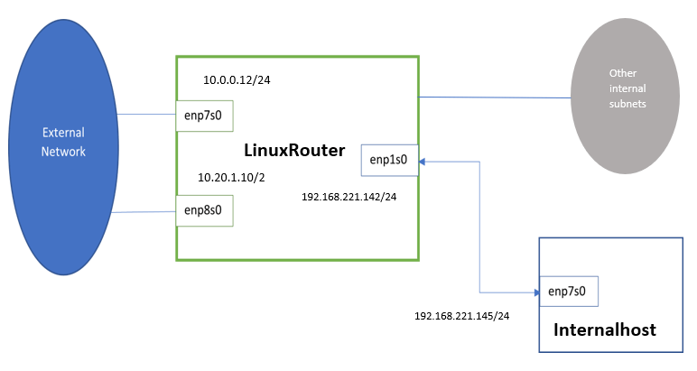

# Network & Securiry administration

### Contents
  * [Networking](#Networking)
  * [Security](#Security)
  * [High Availability](#HA)

 
==============================================================================================

# Networking

### Network Modell: 7 Layer	OSI layer model
  1. Application Layer  : HTTP, FTP, SMTP, DNS, Telnet
  2. Presentation       : ASCII, MPEG, JPEG, MIDI
  3. Session		        : NetBIOS, SAP, SDP, NWLink
  4. Transport(Segment) : TCP, UDP, SPX
  5. Network(Packet)    : IPv4, IPv6, RIP, OSPF, ICMP, IGMP, ARP
  6. Data Link(Frame)   : Ethernet, PPPoE, Token Ring, FFDI, ATM
  7. Physical Layer     : devices

### Hub, Switch and Router
* Hub
  - connects all the network devices together
  - multiple ports
  - not intelligent, do not know where data going to be sent
  - data is copied to all its ports -- broadcasting
* Switch
  - like a hub, accepts ethernet connections from network devices
  - it is intelligent, knows the physical address(MAC address) in switch table.
  - when a data is sent, it is directed to to intended port
  - reduce unnecessary traffic
* Hub and switch are not capable of exchanging data outside its own network, 
  because to be able to reach outside network a device need to be able to read IP addresses
* Router
  - A router routes data from one network to another based on its IP address
  - The gateway of a network
* Hub and switches are used create networks while routers are used to connect networks
* Gateway
  - Gateway is an IP address of the router, while router does a load balancing for requests

### Glossary

* **802.1X**
  -- Enhance security of WLAN by IEEE, provides authentication frame work, allows users to be authenticated by a central authority. wireless.
* **Authenticated DHCP**
  -- First network access control, authenticating user id/password be for delivering a DHCP.
* **Backbone**
  -- Primary connectivity mechanism of a hierarchical distribution system. All systems that have connectivity to the backbone are assured of connectivity to each other.
* **Blacklisting**
  -- An access control system that denies entry to specific users, programs, or net work addresses
* **Berkeley Internet Name Domain (BIND)**
  -- The most commonly used DNS service of the internet
* **Broadcasting**
  -- A packet that is received by all stations in the domain
* **Cyclic Redundant Check (CRC)**
  -- A mathematical calculation on a frame work or cell that is used for error detection. If two CRCs don't match, there is an error.
* **DDI**
  -- a unified service or solution that integrate DNS, DHCP, and IPAM (IP Address Management) into one.
* **Dynamic Host Configuration Protocol**
  -- Assigning IP address to device
* **Domain Name System (DNS)**
  -- the system of domain names. eg. google.com (no www) godaddy.com
* **Frame**
  -- A unit of data transmission in layer two, containing a packet to layer three
* **Hop**
  -- Each time a packet is forwarded, it undergoes a "hop". (traceroute www.google.com)
* **IP Address Management (IPAM)**
  -- The administration of DNC and DHCP. It means Planing, tracking, and managing the Internet Protocol space used in a network. eg. DNS knowing the IP address taken via DHCP, and updating itself.
* **Local Area Network (LAN)**
  -- Its a Network that connects computers and devices in a limited geographical area. oppose with WANs (Wide Area Network). eg. home and school. Smaller area, faster speed, no need for telecommunication line.
* **deep packet inspection**
  -- routers looking inside the data packet other than just read the ip address, take very slow

### IP address

* IP and bit

      IPv4 :  32 Bit Addressen, darstellt in DDN(dotted deciaml notation)
      IPv6 : 128 Bit
      MAC  :  48 Bit

* IP Class

      Private :  10.  0. 0. 0/8  -  10.255.255.255   (1 nets, Class A)
      Private : 172. 16. 0. 0/12 - 172. 31.255.255  (16 nets, Class B)
      Private : 192.168. 0. 0/16 - 192.168.255.255 (256 nets, Class C)

      Loopback: 127.0.0.0 & 127.0.0.1
      Heimnetzwerk(Link Local): 169.254.0.0/16

  * Loopback: 
    Packets sent to this address never reach the network but are looped through the network interface card only. 
    This can be used for diagnostic purposes to verify that the internal path through the TCP/IP protocols is working. 
 
* P-packet forwarding and Internet Control Message Protocol (ICMP) 

      $ vi /etc/sysctl.conf
      $ sysctl -w

      or

      $ /proc/sys/net/ipv4/ip_forward
      $ /proc/sys/net/ipv4/icmp_echo_ignore_all

* IP port number

  To check see services and associated ports

      $ cat /etc/services

  Total 65536(=2^16Bit) Ports available.

          0 -  1023  : Well known Ports
       1024 - 49151  : registered ports
      49152 - 65535  : client ports

  | Port   |      Are      |               Description |
  |--------:|:-------------:|------:|
  |    21  |  FTP    | File Transfer Protocol
  |    22  |  SSH    | Secure Shell
  |    23  |  Telnet | Telnet remote login service, a plan text protocol
  |    25  |  SMTP   | Simple Mail Transfer Protocol
  |    53  |  DNS    | Domain Name System service
  |    80  |  HTTP   | Hypertext Transfer Protocol
  |   110  |  POP3   | Post Office Protocol
  |   119  |  NNTP   | Network News Transfer Protocol
  |   123  |  NTP    | Network Time Protocol
  |   143  |  IMAP   | Internet Message Access Protocol
  |   161  |  SNMP   | Simple Network Management Protocol
  |   194  |  IRC    | Internet Relay Chat
  |   443  |  HTTPs  | secure HTTPs
  |   993  |  imaps  | secure IMAPs
  |   995  |  pop3s  | secure POP3
  |  3128  |         | Proxy server port
  |  7100  |         | X-Font server port
  |  8080  |         | extended HTTP port

### Get the hostname from an IP Address in Linux

    $ host 8.8.8.8
    $ dig -x 8.8.8.8   
    $ dig -x 8.8.8.8 +noall +answer        : noall removes all lines in the output   
    $ nmblookup -A 192.168.1.142  

    $ nbtscan 192.168.1.142                
    $ avahi-resolve -a 192.168.1.142

### How do I know my public IP in local machine?

    $ curl ipinfo.io/ip
    $ curl -s ipinfo.io/ip
    $ wget -qO- http://ipecho.net/plain ; echo
    $ dig +short myip.opendns.com @resolver1.opendns.com

### Get a list of all IP addresses on a LAN

    $ ifconfig                             <---- one can extract ip from inet & broadcast column

    $ netdiscover -r 192.168.1.0/24
    $ nmap -sP --unprivileged 192.168.1.0/24

    or use angry IP scanner

### Find primary IP address of a linux
* Primary active interface first

      $ ip address show
      $ route

* Primary IP address

      $ ip address show dev ens33 
      $ ip address show dev ens33 | grep -w inet | awk '{print $2}'   
      $ ip route get 1.1.1.1
        1.1.1.1 via 192.168.207.2 dev ens33 src 192.168.207.128 uid 1000           : primary = 192.168.207.128
      $ ifconfig ens33 | grep -w inet | awk '{print $2}'
      $ nmcli 
      $ curl ifconfig.me

### Get external IP address in a shell script
* Network interface first

      $ ip address show
      $ ip address show eif0 | grep 'inet'
        169.254.6.66
      $ ip address show eif0 | grep 'inet'
        2001:db8:666:666::10

* External IP Checks

      $ ssh user@server-router 'ip address show eif0'

      $ curl --user USERNAME:PASSWORD http://router/
      $ ssh sshmyip.com
      $ telnet telnetmyip.com
      $ wget -qO- telnetmyip.com

* DNS IP query

      $ dig +short myip.opendns.com @resolver1.opendns.com
      $ host myip.opendns.com resolver1.opendns.com
      $ dig +short txt ch whoami.cloudflare @1.1.1.1
      $ dig +short txt o-o.myaddr.test.l.google.com @ns1.google.com

+ unnpc 

      $ UPNP_DATA = $(upnpc -s | grep ^ExternalIPAddress | cut -c21-)
      $ echo "${UPNP_DATA}"

### Mapping hostnames with ports in /etc/hosts
Look into /etc/hosts first

    $ vi /etc/hosts
      127.0.0.1         dongheekang.com                : this is ok
      127.0.0.1:8080    dongheekang.com                : port 8080 does not work!!!

For Nginx, one can deal port!

    $ vi /etc/nginx/conf.d/dongheekang.conf
      server {
          listen 80;

          server_name dongheekang.com;

          location / {
              proxy_pass http://127.0.0.1:8080/;
          }
      }
  
### How to check port?

    $ netstat -ltnup | grep ':22'
    $ ss -ltnup 'sport = :22'
    $ lsof -i :22 -i :68
    $ fuser -v 22/tcp 68/udp

    options (netstat & ss)
    -------------------------------------------
    l: show only listening sockets
    t: filter TCP connections/sockets
    n: displays the port numbers
    u: show UDP connections
    p: show process id/program name
    -------------------------------------------

### How to find an open port? 

    $ ss -tnlp 
    $ netstat -tnlp
    $ lsof -i -P -sTCP:LISTEN                         : using the root user
    $ nmap google.com

### Port scanning for UDP

    $ nmap -sU -v 172.16.38.137                      : - sU option specifies a UDP scan
    $ nc -vz -u 8.8.8.8 443                          : -u specify UDP -z send empty packet

    $ iperf3 -s                                      : -s server on the server side
    $ iperf3 -u -c 172.16.38.137                     : -u specify UDP on the client side

### Checking the number of open HTTP connections with Netstat

* netstat

    $ netstat -a
      Active Internet connections (servers and established)              <----------- this one is important
      Proto Recv-Q Send-Q Local Address           Foreign Address         State
      udp        0      0 192.168.238.129:bootpc  192.168.238.254:bootps  ESTABLISHED
      raw6       0      0 [::]:ipv6-icmp          [::]:*                  7
      Active UNIX domain sockets (servers and established)               <----------- interanl communication only
      Proto RefCnt Flags       Type       State         I-Node   Path
      unix  3      [ ]         DGRAM      CONNECTED     15330    /run/systemd/notify
      unix  2      [ ACC ]     STREAM     LISTENING     15333    /run/systemd/private

    
* explanation I

      Proto  : protocol(TCP or UDP).
      Recv-Q : bytes in the queue for that socket.
      Send-Q : If both the Recv-Q and Send-Q are at 0, the applications on both sides of the connection are okay
      Local Address   : The address and the port number of the local end of the socket.
      Foreign Address : The address and the port number of the remote end of the socket.
      State           : 
          ESTABLISHED : A working connection has been established between the two endpoints, allowing data to be transferred.
          SYN-SENT    : made a connection request and is waiting for the remote host to accept.
          CLOSING     : The socket is waiting for a termination connection request acknowledgment from the remote connection.

* explanation II       
      
      Proto : protocol used by the socket. It will be ‘unix’.
      RefCnt: Reference Count. It shows the number of processes attached to this socket.
      Flags : usually set to ACC for SO_ACCEPTON. Socket is waiting for a connection request. 
              SO_WAITDATA, displayed by W 
              SO_NOSPACE, displayed by N
              SO_WAITDATA the socket needs to read, while SO_NOSPACE means there is no space to write data
      Type  : socket type.
              STREAM: Stream socket. The communication is reliable. The packets will arrive in order.
              DGRAM: Socket is in Datagram mode. a connectionless network socket. packets arrive out of order and might not arrive.
      State : 
          FREE         : This socket is not allocated.
          LISTENING    : The socket is in the process of listening for incoming connection requests.
          CONNECTING   : The socket is about to establish a connection.
          CONNECTED    : A connection has been established with another application, and the socket is able to transmit.
          DISCONNECTING: The socket is disconnecting.
      I-Node: Unix sockets are files. Therefore, the I-Node field points to the metadata of the socket.
      Path  : The path of the socket file.
 
* List Only HTTP Connections

      $ netstat -an | grep :80 
      $ netstat -a | grep http 

### How to ping a specific port? 

    $ ssh -Y -C root@x.x.x.x
    
    root@TestGRC:~# export XAUTHORITY=$HOME/.Xauthority
    root@TestGRC:~# firefox -no-remote https://www.grc.com/

    then open a https://www.grc.com/port_111.htm                 : profiling 

    $ IP=78.141.212.157                     : testing machine's IP
    $ PORT_OPEN=22
    $ PORT_CLOSED=111
    $ PORT_STEALTH=137

    $ nmap -p $PORT_OPEN,$PORT_CLOSED,$PORT_STEALTH $IP
    $ nping -p $PORT_OPEN,$PORT_CLOSED,$PORT_STEALTH $IP
    $ nc -vz $IP $PORT_OPEN
    $ nc -vz $IP $PORT_CLOSED
    $ nc -vz $IP $PORT_STEALTH                          : need to ctrl+c in order to stop
    $ telnet $IP $PORT_OPEN
    $ curl $IP:$PORT_OPEN

### How to kill running on a specific port?

creat three processes using port 9999 and the protocols SCTP, TCP, and UDP respectively.

    $ socat sctp-listen:9999,bind=127.0.0.1 stdout &
      [1] 6424
    $ socat tcp-listen:9999,bind=127.0.0.1 stdout &
      [2] 6431
    $ socat udp-listen:9999,bind=127.0.0.1 stdout &
      [3] 6438

Solution 
* fuser

      $ fuser -k 9999/tcp
      9999/tcp: 6431

* kill

      $ kill -9 6431

* lsof
      
      $ lsof -i udp:9999 | awk '/9999/{print $2}' | xargs kill

* ss or netstat

      $ ss -Slp | grep -Po ':9999\s.*pid=\K\d+(?=,)' | xargs kill
      $ netstat -Slp | grep -Po ':9999\s.*LISTEN.*?\K\d+(?=/)' | xargs kill

### How to open a port in linux?

list the firewall rules using the iptables first and then set rules

    $ sudo iptables -L
    $ sudo iptables -A INPUT -p tcp --dport 8080 -j ACCEPT    : allows web traffic coming to server port 8080
    $ sudo iptables -I INPUT -p tcp --dport 23 -j DROP        : block all incoming telnet

see also iptables 

### Freeing up a TCP/IP port

Sometimes there isn’t any process using the port and, even so, the system tells us the port is busy or in use. 
This is usually because of the TIME-WAIT state. If this is the case, we only have to wait until the system frees it up, 
by default the timeout is 2 minutes.

    $ fuser -k 8000/tcp
    $ fuser -i -TERM -k 8000/tcp                 : use SIGTERM to do more carefully!

    $ lsof -i :8000
    $ ss -apt 'sport = :8000'
      Netid  State      Recv-Q Send-Q Local  Address:Port  Peer Address:Port                
      tcp    LISTEN     0      128    *:ssh                *:*                 users:(("sshd",pid=1226,fd=3))
      ......
      tcp    TIME-WAIT  0      0      192.168.0.4:56886    192.168.0.5:https

    TIME-WAIT: the process closed the connection, and the port is waiting for a timeout without any process using it.

### Make Apache Web Server listen on two different ports

      $ vi /etc/apache2/ports.conf
        ...
        Listen 80
        Listen 8888 
        ...
        <IfModule ssl_module>
        ...

      for virtual host
      $ vi /etc/apache2/sites-enabled/000-default.conf
        <VirtualHost *:80 *:8888> 
        ... 
        </VirtualHost> 
        ...

      $ sudo service apache2 restart
      $ sudo netstat -nltp | grep apache

### Domain Name System (DNS)

* working principle: resolves domain names to IP addresses

      1. domain name typed in
      2. DNS server search through its database to find its matching IP address
      3. DNS will resolve the domain name into IP addresses

* DNS Types

      Master (Primary) DNS Server
      Slave (Secondary) DNS Server
      Caching (hint) DNS Server
      Forwarding (Proxy, Client, Remote) DNS Server
      Stealth (DMZ or Split) DNS Server
      Authoritative Only DNS Server
      Recursive name server = cache name server = resolving name server

* Detailed Steps

      1. type in the Domain Name in web browser
      2. if the computer can't find its IP address in its cache memory, it will send the query to the Resolver server(basically your ISP)
      3. Resolver will check its own cache memory, if not, it will send the query to Root server, the top or the root of the DNS hierarchy, 13 sets of root servers around the world, operated by 12 organizations. each set has its own IP address
      4. he root server will direct the resolver the Top Level Domain server (TLD), for the .com, .net, .org(top level domains) domain.
      5. TLD will direct the resolver to the Authoritative Name Server(ANS), and the resolver will ask the ANS for the IP address
      6. ANS is responsible for knowing everything including the IP address of the domain
      7. ANS will respond with IP address
      8. the resolver will tell the computer the IP address
      9. the resolver will store the IP Address in its cache memory

* DNS configuration

      $ cat /etc/hosts                              
      $ cat /etc/hostname
      $ cat /etc/hosts.conf
      $ cat /etc/nsswitch.conf  | grep hosts       : to setup the priority of DNS lookup      
      $ cat /etc/resolv.conf

* etc/hosts: highest priority

      To point to a.localhost.com, we need to add the following lines:

      $ vi /etc/hosts
        127.0.0.1        a.localhost.com
        192.168.56.103   dongheekang.com

      $ vi /etc/dnsmasqd.conf
        address=/localhost.com/127.0.0.1

      $ curl localhost                    : Using localhost as the domain
      $ curl a.localhost

* /etc/resolv.conf
      $ cat /etc/resolv.conf
        nameserver 192.168.204.231
        nameserver 192.168.154.6
        nameserver 2c0f:fe38:2405:41a3::77

* DNS Testing and looup

      $ host dongheekang.com                : to get host information from name server
      $ ping -c 1 dongheekang.com
      $ nslookup dongheekang.com            : tool to ask host information from name server
      $ dig A +short dongheekang.com        : after finish DNS configuration, one can test DNS, A = ipv4
      $ whois                               : a program to find domain holder
      $ getent                              : a tool for carry out the database of administrator
      $ rndc                                : name server control utility for BIND
      $ sudo tcpdump -i enp0s8

      $ vi /etc/bind/named.conf        debian
      $ vi /etc/named/named.conf       fedora
   

* DNS operation (permanant way)

  To apply DNS resolve permanantly, use resolvonf (not resolv.conf) that can be started by systemctl

      $ sudo apt-get install resolvconf
      $ sudo systemctl start resolvconf.service
      $ sudo systemctl enable resolveconf.service

  after starting resolvconf then add nameserver into the configuration file. 

      $ sudo vi /etc/resolv.conf/resolvconf.d/head
      nameserver 8.8.8.8
      nameserver 8.8.4.4

* systemd-resolved / avahi

  systemd-resolved or avahi should be an optionl choice instead of resolv.conf!
  https://www.baeldung.com/linux/resolve-conf-systemd-avahi

      $ vi /etc/systemd/resolved.conf.d/dns_servers.conf
      $ vi /etc/systemd/resolved.conf.d/configured.conf
      $ vi /etc/systemd/resolved.conf

      $ sudo systemctl start systemd-resolved.service
      $ sudo systemctl enable systemd-resolved.service

### DNS caching
    DNS Caching intercepts hostname requests of recently visited websites before they’re sent out to the internet and refers them to its local database. This significantly reduces the time taken to load already visited websites as their respective IP address have already been cached.

* configure systemd-resolved first

      $ sudo resolvectl status
      $ sudo systemctl start systemd-resolved.service
      $ sudo systemctl enable systemd-resolved.service

      $ sudo nano /etc/systemd/resolved.conf
      DNS=8.8.8.8 8.8.4.4

      $ sudo mv /etc/resolv.conf /etc/resolv.conf.original

      $ sudo ln -s /run/systemd/resolve/stub-resolv.conf /etc/resolv.conf

      $ sudo systemctl restart systemd-resolved.service

* using BIND 9

      $ sudo apt update
      $ sudo apt install bind9 bind9utils -y

      $ sudo systemctl start --now named
      $ sudo systemctl enable --now named
      $ sudo systemctl stop --now named
      $ sudo systemctl restart --now named

      test 
      $ dig +noall +stats donghee.com
        ;; Query time: 23 msec                 <-------- 23 msec at first attempt
        ;; SERVER: 127.0.0.1#53(127.0.0.1)
        ;; WHEN: Sat Jan 01 11:19:05 EST 2022
        ;; MSG SIZE  rcvd: 56
      $ dig +noall +stats donghee.com
        ;; Query time: 0 msec                  <-------- now 0 msec because of caching
        ....

* using dnsmasq

      $ sudo apt-get install dnsmasq
      $ sudo systemctl start dnsmasq
      $ sudo systemctl enable dnsmasq    

      $ dig +noall +stats donghee.com

      We can also clear the dnsmasq cache by restarting it:
      $ sudo systemctl restart dnsmasq

### Waht about the security issue about DNS? 
* Security

   Firewall open via iptables configuration

      $ vi /etc/iptables/rules           : debinas
      $ vi /etc/sysconf/iptables         : CentOS, Fedora

* DNS Security Extensions
  TSIG or DNSSEC

### List assigned DHCP IP addresses

  Basic

      1. The client sends a broadcast DHCP Discover packet. It also sends the last address it had, if any.
      2. The server responds with a DHCP Offer. It can renew the last lease, or just send a new one.
      3. The client broadcasts a DHCP Request to accept the offer.
      4. The server sends a DHCP Acknowledge confirming the lease.

  From the server side
  
      $ vi /var/lib/dhcpd/dhcpd.leases
        lease 192.168.1.100
        { 
        starts 4 2022/07/22 20:27:28;
        ends 1 2022/07/26 20:27:28;
        tstp 1 2022/07/26 20:27:28;                : statement specifies the failover protocol
        binding state free;
        hardware ethernet 00:1b:77:93:a1:69;
        uid "\001\000\033w\223\241i";
        }

      $ egrep "lease|hostname|hardware|\}" /var/lib/dhcpd/dhcpd.leases
      $ dhcp-lease-list --lease /var/lib/dhcpd/dhcpd.leases

  alternative way

      $ cat /var/lib/dhcpcd5/dhcpcd-richard01-Richard123.lease | dhcpcd --dumplease
      $ dhcpcd --dumplease richard01

      $ grep -IR "DHCPOFFER" /var/log/*

      $ journalctl | grep -m1 DHCPACK

      $ arp -a

### How do I find if there is a rogue DHCP server on my network

      $ sudo dhclient -v
      $ ifconfig | grep "inet"

      $ nmap -sV --allports -T4 192.x.x.x
      $ sudo nmap --script broadcast-dhcp-discover -e eth0 

      $ sudo nmap -sV --allports -T4 192.168.x.x

### Multiple DHCP servers on the network

* procedure

      1. Create subnetworks: : Each subnetwork has its own DHCP server.
      2. Create a failover configuration: Main and standby server 
      3. Split the address pools between multiple DHCP servers: 

* editing the configurations in DHCP server

      $ vi /etc/dhcp/dhcpd.conf
      subnet 239.252.197.0 netmask 255.255.255.0 {
          range 239.252.197.10 239.252.197.250;
          default-lease-time 600 max-lease-time 7200;
          option subnet-mask 255.255.255.0;
          option broadcast-address 239.252.197.255;
          option routers 239.252.197.1;                         <--------- this is important!
          option domain-name-servers 239.252.197.2, 239.252.197.3;
          option domain-name "isc.org";
      }

      $ vi /etc/dnsmasqd.conf
        # Define the subnet
        dhcp-range=239.252.197.10,239.252.197.250,255.255.255.0,2h
        # DNS configuration
        server=239.252.197.2
        server=239.252.197.3
        dhcp-option=option:domain-search,isc.org
        # Default router
        dhcp-option = option:router, 239.252.197.1

      https://www.linux.com/topic/networking/advanced-dnsmasq-tips-and-tricks/

### SSH Proxying and tunneling

* Server side configuration: sshd

      $ vi /etc/ssh/sshd_config 
      -------------------------------------------------------------------------------------------------------------
      AllowStreamLocalForwarding   : Allows Unix domain sockets to be forwarded. 
      AllowTcpForwarding           : Allows TCP port forwarding. 
      DisableForwarding            : Disables all kinds of forwarding.
      GatewayPorts                 : Allows to use the ports forwarded to a client 
      PermitListen                 : Specifies the addresses and ports (‘127.0.0.1’)
      PermitOpen                   : Specifies the address and ports
      PermitTunnel                 : Specifies whether tun device forwarding is allowed. 
      X11Forwarding                : Specifies whether X11 forwarding is allowed. 
      X11UseLocalhost              : Forces X11 forwarding to be allowed from the SSH server host loopback address. 
      -------------------------------------------------------------------------------------------------------------

  need to be confirmed that firewalls must allow the SSH traffic, usually on port TCP/22, since some host firewall configurations might limit the ability to connect to and from external services, and iptables needs to be touched further later on

* Forward
  * Single-Port

      A forward or direct TCP tunnel is the one that follows the direction of the SSH connection from the client to the SSH server. 

        $ ssh -L [bind_address:]port:host:hostport [user@]remote_ssh_server
        $ ssh -L 0.0.0.0:8022:10.1.4.100:22 user@10.1.4.20
               
        possible this as well. 
        $ ssh -L local_socket:host:hostport [user@]remote_ssh_server
        $ ssh -L local_socket:remote_socket [user@]remote_ssh_server

  * Dynamic or Multi-Port

    A special case of the forward TCP tunnels is the Socks proxy capability. Using these options, the SSH client listens on a specified binding port and acts as a SOCKS 4 or 5 proxy server.

        $ ssh -D [bind_address:]port [user@]remote_ssh_server
        $ ssh -D 8080 user@10.1.4.100

* Reversed
  * Single-Port

    The reverse or callback proxies allow us to do tricks similar to the one above but in the reverse direction. We can open services on our own local networks to hosts on the remote side of the SSH session.

        $ ssh -R [bind_address:]port:host:hostport [user@]remote_ssh_server
              
        optional possible 
        $ ssh -R remote_socket:host:hostport [user@]remote_ssh_server
        $ ssh -R remote_socket:local_socket [user@]remote_ssh_server
        $ ssh -R [bind_address:]port:local_socket [user@]remote_ssh_server         

  * Dynamic or Multi-Port

    Finally, we can expose a SOCKS proxy server on the remote host directed to the client’s network as we can do with direct forwarding. 

        $ ssh -R [bind_address:]port [user@]remote_ssh_server

* X window turnnel

      $ ssh -X [user@]remote_ssh_server
      $ ssh -Y [user@]remote_ssh_server

* Multiple Tunnels and Multiple Host Hopping

      $ ssh -X -L 5432:<DB server IP>:5432 -R 873:<local RSYNC server>:873 [user@]remote_ssh_server

      server1 -> server2 -> server3 
      $ ssh -L 8022:<server2>:22 user@server1
      $ ssh -L 8023:<server3>:22 -p 8022 user@localhost
      $ ssh -p 8023 user@localhost

* configuration for above

      $ vi /etc/ssh/ssh_config
        host 10.1.4.100
          ForwardX11 yes
          LocalForward 0.0.0.0:5432 10.1.4.200:5432
          RemoteForward localhost:8022 localhost:22
          user dongheekang

* Persistent Tunnels

      $ autossh [-V] [-M port[:echo_port]] [-f] [SSH_OPTIONS]
      $ autossh -X -L 5432:<DB server IP>:5432 -R 873:<local RSYNC server>:873 [user@]remote_ssh_server
      $ autossh -f [host]

### Classical tunneling for SSH

* SSH

      - background
      $ nohup

      - from local:27107 to 147....148:27017 
      $ ssh -g -L 27017:147.204.68.148:27017 -f -N User@jumphost
      $ ssh -f -N opennebula_user@hybris.com -L 12633:opennebula.sin.hybris.com:2633

      - access with tunneling port
      $ telnet localhost 27017
      telnet> quit

      - For HCM Mongo Testen
      Mongo      147.204.68.148:27017
      EMEA6      mo-cf345a9e2     10.97.178.61
      $ ssh -L 27017:147.204.68.148:27017 -f -N c5258293@mo-cf345a9e2.mo.sap.corp

      - For VMware Testen
      Vmware     10.248.41.226:443
      EMEA5      mo-2f62a050c     10.97.150.83
      $ ssh -g -L 50050:10.248.41.226:443 -f -N c5258293@mo-2f62a050c.mo.sap.corp

      - N : port forwarding
      - f : set the ssh in the background before executing any command
      - g : listening port remains available for other network connections and is not restricted to connections originating in the localhost

* ncat

      $ ncat -l -p 8001 -c "ncat 127.0.0.1 8000"
      $ ncat -l -p 8001 -c "ncat localhost 8000"
      $ ncat -k -l -p 8001 -c "ncat localhost 8000"

      - l : to listen for incoming connections
      - p : to specify the source port to be used
      - k : to keep it running

* socat

      $ socat tcp-listen:8001 tcp:localhost:8000
      $ socat tcp-listen:8001,reuseaddr,fork tcp:localhost:8000
      $ socat tcp-listen:8001,reuseaddr,fork tcp:localhost:8000 &

### How to set jump host?

    • How do I use jump host (local -> server1 -> server2)

      $ ssh -tt server1 ssh server2

      $ ssh -fqN -L2222:server2:22 server1
      $ ssh localhost -p 2222

      $ ssh -o ProxyCommand="ssh server1 nc server2 22" server2
      $ ssh -o ProxyCommand="ssh -W server2:22 server1" server2

      or one can configure server2 via server1, i.e. go to server1 and configure this
      $ vi ~/.ssh/config
      |Host s2
      |HostName server2
      |User user2
      |IdentityFile ~/.ssh/server2_id_rsa
      |ProxyCommand ssh -W server2:22 server1
      $ ssh s2
      $ ssh user2@s2

### Linux TCP/IP connections Limit
the limits on the number of concurrent TCP connections

via Kernel-Level

      $ cat /proc/sys/fs/file-max
      $ sysctl fs.file-max=65536

      $ vi /etc/sysctl.conf 
        fs.file-max=65536  # Limits the number of open files to 65536

      $ cat /proc/sys/fs/file-nr
        1952    0       2147483647        1952 is used from total 214783647 

via Processes and Threads

      $ sysctl -w kernel.threads-max=120000 >> /etc/sysctl.conf
      kernel.pid_max
      kernel.threads-max

via network stack kernel parameters

      $ sysctl -w knet.netfilter.nf_conntrack_max=100 >> /etc/sysctl.conf

      net.netfilter.nf_conntrack_max
      nf_conntrack_tcp_timeout_*
      net.core.netdev_max_backlog
      ...... many other parameters

User-Level Descriptors Limits

      $ ulimit -u 
      $ ulimit -s 

      $ /etc/security/limits.conf
        #<domain>      <type>  <item>         <value>
        oracle          hard    nofile         8192
        nproc
        
via iptables
      $ /sbin/iptables  -A INPUT -p tcp --syn --dport 22 -m connlimit --connlimit-above 3 -j REJECT

### Maximum number of threads per process in Linux (move to the processes)

      $ cat /proc/sys/kernel/threads-max
      $ sysctl -a | grep threads-max
      $ cat /proc/sys/kernel/pid_max 
      $ cat /proc/sys/vm/max_map_count
      65530
      $ grep -i "^UserTasksMax" /etc/systemd/logind.conf

      $ echo 120000 > /proc/sys/kernel/threads-max
      $ sysctl -w kernel.threads-max=120000 >> /etc/sysctl.conf
      $ echo 200000 > /proc/sys/kernel/pid_max
      $ echo 600000 > /proc/sys/vm/max_map_count

      $ sed -i "s/^UserTasksMax/#UserTasksMax/" /etc/systemd/system.conf
      $ echo "UserTasksMax=60000" >> /etc/systemd/system.conf

      $ grep -i "UserTasksMax" /etc/systemd/logind.conf
      #UserTasksMax=50000
      UserTasksMax=60000

      $ ulimit -a | grep "stack size"
      stack size              (kbytes, -s) 10240
      $ ulimit -s 8192

### netcat(nc) 
    
* reading and writing data across the network, through TCP or UDP 

      $ nc -z -v -w 1 google.com 442-444  : Scanning for Open Ports

      server node
      $ nc -lv 1234                       : listen to port 1234 
      client node
      $ nc -v localhost 1234              : open up a netcat process that connects to localhost at port 1234 

      $ nc -l -v -k localhost 1234        : server and client netcat processes will return whenever the connection is terminated  

* A netcat process 
  
  first constructs a legitimate HTTP response using echo and process substitution, 
  listens to port 1234 and serves the file whenever a client connects to our server:

      $ echo -e "HTTP/1.1 200 OK\n\n$(cat index.html)" | nc -l 1234

* Improvement

  we wrapped the command into a while loop. In consequence, whenever the command terminates, it’ll restart the process 
  and using -w flag allows us to specify the timeout value

      $ while true; do echo -e "HTTP/1.1 200 OK\n\n$(cat index.html)" | nc -l -w 1 1234; done

      How do create index.html?
      ------------------------------------------------
      cat -> index.html <<<EOF
      <!DOCTYPE html>
      <html>
        <head>
          <title>Simple Netcat Server</title>
        </head>
        <body>
          <h1>Welcome to simple netcat server!<h1>
        </body>
        </body>
      <html>
      EOF
      -------------------------------------------------

* Reserve shell connection: 

  set server node

      - Listening on 0.0.0.0 1234
      - Connection received on server.dongheekang 36170

      $ nc -lv 1234
      $ mkfifo /tmp/rs
      $ cat /tmp/rs | /bin/bash 2>&1 | nc -v client 1234 > /tmp/rs

      -  checking

      $ hostname
      $ server

  any text sent by the client node will then be piped to /tmp/rs

* Reserve proxy connection: 

  set server node
  
      $ mkfifo /tmp/rp
      $ nc -lv 1234 < /tmp/rp | nc localhost 4321 > /tmp/rp

  the first process the external router and the second process the internal router.
  When there is incoming traffic on port 1234, the external router pipes the traffic to the internal router.
  when there’s outgoing traffic from port 4321, the internal router will pipe it to the pipe /tmp/rp. 
  Then, the external router(server) will read and send the content of /tmp/rp to the client (outside).

* To test the correlation between two computers without firewall
  bidirectional interactive text-oriented communication facility

      $ server1> nc -l 4444
      $ server2> nc server1.com 4444

### iperf
Performance Counters for Linux. we need to install iPerf on both the client and the server

* Server

      $ iperf -s                            : -s (server) option
      $ iperf -s -u -p 5003                 : -u specify the server use UDP and listen on port 5003

* Client: 
      
      Connecting to the Server From the Client

      $ iperf -c 5.182.18.49
      $ iperf -c 5.182.18.49 -i 5 -t 15 -w 416K -p 5003
      $ iperf -c 5.182.18.49 -u -b 1000M 

      * i specifies the interval time in seconds. 10 is the default
      * t specifies the time to run the test in seconds
      * p specifies the port. 5001 is the default
      * w specifies the TCP window size. 85 KB is the default
      * u upd
      * b limits the bandwidth for UDP to 1Mbits/sec by default

### How to list all connected SSH sessions (possible commands)

      $ who
      $ w
      $ sudo last | grep 'still logged in'  
      $ sudo netstat -atnp | grep 'ESTABLISHED.*sshd'
      $ ss | grep ssh
      $ ps axfj | grep sshd

### Find the IP Address of the Client in an SSH Session (possible commands)

      $ who
      $ w
      $ finger
      $ pinky  
      $ last | head
      $ sudo netstat -tpn | grep "ESTABLISHED.*sshd"
      $ sudo ss -tp | grep "ESTAB.*sshd"
      $ sudo lsof -i TCP -s tcp:established -n | grep ssh

### Translate DNS to IP

      $ ping dongheekang.com
      $ host dongheekang.com
      $ host -t a dongheekang.com
      $ nslookup dongheekang.com
      $ dig dongheekang.com A +short
      $ dig dongheekang.com AAAA +short
      $ nmap -sn dongheekang.com

### Route specific subnet to a particular interface

* ip-route : routing table management

      $ ip monitor                                      : live monitoring for connection of MAC and IP
      $ ip rule list                                    : To look up the route table and rule
      $ ip route 
        default via 194.168.23.1
        194.168.23.132:24´ via 194.168.23.1 dev enp1s0 scope link src 194.168.23.120 metric 100
        <address>:<mask> via <gateway> <interface> scope link <source address> 

      
      $ ip route get 194.168.23.132                   

        194.168.23.132 via 194.168.23.1 dev enp1s0 src 194.168.23.120 uid 1000 
        cache  

      so we can identify 
        gateway      : 194.168.23.1 
        destination  : 194.168.23.132

      to test connection do this
      $ traceroute 172.23.1.100  

* add routes

    

      want to access 100.1.1.0/24
      we have now under subnet 192.168.221.0/24 with a second network interface
      how to add routing ? 

      $ ip route add 100.1.1.0/24 via 192.168.221.142 dev enp7s0     : add static router

      this is example of "ip route" or "route"

      $ ip route add default via 192.168.1.254       : add routing table of network for default gw
      $ route add default gw 20.14.5.65              : add routing table of network for default gw

* To make the routes persistent (nmcli)

  Destnation-based

      $ systemctl status NetworkManager
      $ nmcli connection modify enp7s0 +ipv4.routes "100.1.1.0/24, 8.8.8.8 192.168.221.142"
      $ cat /etc/sysconfig/network-scripts/route-enp7s0 
        ADDRESS0=100.1.1.0
        NETMASK0=255.255.255.0
        ADDRESS1=8.8.8.8
        NETMASK1=255.255.255.255
        GATEWAY1=192.168.221.142

  Source-based
      
      IP masquerading
      $ firewall-cmd --change-interface=enp7s0 --zone=external --permanent
      $ firewall-cmd --change-interface=enp8s0 --zone=external --permanent
      $ firewall-cmd --change-interface=enp1s0 --zone=internal --permanent
      $ firewall-cmd --zone=external --add-masquerade --permanent

      create the custom routing table and rule
      $ nmcli connection modify enp8s0 +ipv4.routes "100.1.1.0/24 10.20.1.1 table=400, 8.8.8.8 10.20.1.1 table=400"
      $ nmcli connection modify enp8s0 +ipv4.routing-rules "priority 200 from 192.168.221.0/24 table 400"
      $ cat /etc/sysconfig/network-scripts/ifcfg-enp8s0
      $ nmcli device reapply enp8s0                 : start table
      $ ip route show table 400                     : validation

      test
      $ ping 100.1.1.100
      $ tcpdump -i enp8s0 host 100.1.1.100 -n 

###  Resolving MAC address from IP address in linux

      $ ip a 
      $ arp -a            :  address resolution protocol(arp) one can access MAC address in local network

      $ ip neighbour show
        172.16.187.2 dev ens160 lladdr 00:50:56:f3:ce:92 STALE                     : gateway node
        172.16.187.129 dev ens160 lladdr 00:0c:29:02:d4:5a REACHABLE               : host in our LAN
      $ ip route                       : only retrieve MAC addresses in local network
        
### Configure network settings using network manager in Linux
* nmcli

      $ sudo apt-get install network-manager
      $ systemctl status NetworkManager

      $ nmcli device                            : Displaying the List of All Network Devices
      $ nmcli device show wlp5s0                : Displaying the IP Address of a Device
      $ nmcli connection                        : Displaying the List of Existing Connections
      $ nmcli connection show id my-ethernet    : Displaying the Properties of a Connection
      $ nmcli radio                             : Displaying the Status of Wireless Adapters

* Configuring an Ethernet Adapter With a Static IP Address

      $ nmcli connection add type ethernet ifname enp7s8 con-name my_ethernet ip4 192.168.2.138/24 gw4 192.168.2.1

* Configuring an Ethernet Adapter With a Dynamic IP Address

      $ sudo nmcli connection add type ethernet ifname enp7s8 con-name my_ethernet

* Modifying connection

      $ sudo nmcli connection modify my_ethernet ipv4.DNS 192.168.2.1

* Enable and disable
      $ nmcli connection down my_ethernet
      $ nmcli connection up my_ethernet

### Configuring netwrok interface

* check 

      $ ls /sys/class/net
        eth0 lo wlan0 
      $ ip link 
      $ ip addr
      $ ifconfig -a                    : see more ifconf session 
      $ brctl show    

* configurations

      $ cat /etc/network/interfaces                    : for Debian
      $ cat /etc/sysconfig/network                     : for CentOS
      $ cat /etc/sysconfig/network-scripts/ifcfg-eth0  : for CentOS

* run interface

      $ /etc/init.d/networking restart        : for Debian
      $ /etc/rc.d/init.d/network restart      : for CentOS

* Netzwerkkonfiguration Debian or Ubuntu Server

      $ vi /etc/network/interfaces
      |auto eth0
      |iface eth0 inet dhcp             
      |sudo ifup eth0
      |auto eth0:0
      |iface eth0:0 inet static
      |  address ABC.DEF.GHI.JKL
      |  netmask 255.255.255.255
      |  network ABC.DEF.GHI.0
      |  broadcast ABC.DEF.GHI.JKL
      |  gateway 10.255.255.1
      
      $ vi /etc/network/interfaces
      |auto eth0
      |iface eth0 inet static
      |  address 192.168.1.100
      |  netmask 255.255.255.0
      |  gateway 192.168.1.1
      |dns-nameservers 8.8.8.8 8.8.4.4
      |pre-up /usr/local/sbin/start-iptables.sh
      |post-up /usr/local/sbin/backup-log.sh

* Netzwerkkonfiguration CentOS

      $ vi /etc/sysconfig/network-scripts/ifcfg-eth0
      |ONBOOT=no
      |ONBOOT=yes
      |ifup eth0

      $ cp -a /etc/sysconfig/network-scripts/ifcfg-eth0 /etc/sysconfig/network-scripts/ifcfg-eth0:0
      $ vi ifcfg-eth0:0
      |DEVICE=eth0:0
      |BOOTPROTO=static
      |BROADCAST=ABC.DEF.GHI.JKL
      |IPADDR= ABC.DEF.GHI.JKL
      |NETMASK=255.255.255.255
      |NETWORK= ABC.DEF.GHI.0
      |ONBOOT=yes
      |NM_CONTROLLED=no

* enable or unable

      $ sudo ifdup eth0
      $ sudo ifdown eth0

* some tip
      
      if /etc/network/interface file is empty, then no service with network manager

      $ sudo systemctl stop NetworkManager.service
      $ sudo systemctl disable NetworkManager.service
### Network command set with options

* ifconfig

  inspect and reconfigure network interfaces on a Linux machine

      $ ifconfig -a                       : list all
      $ ifconfig -s                       : short for programming
      $ ifconfig ens33                    : specific interface 
      
      $ sudo ifconfig ens33 down          : interface up or down 

      set 
      $ sudo ifconfig ens33 192.168.91.200
      $ sudo ifconfig ens33 netmask 255.255.0.0
      $ sudo ifconfig ens33 broadcast 10.2.255.255
      $ sudo ifconfig ens33 10.2.1.101 netmask 255.255.0.0 broadcast 10.2.255.255

* nslookup

  to query domain name servers (DNS) and is available for operating systems

      $ nslookup                                 : this is interactive 
      $ nslookup dongheekang.com                 : Lookup a Domain
      $ nslookup -type=a dongheekang.com         : get all DNS entries
      $ nslookup -type=soa dongheekang.com       : look at the authoritative (SOA) information about the domain
      $ nslookup -type=ns dongheekang.com        : look at the name server information

* tracert

  to track the exact route a given packet takes, since network traffic doesn’t go directly to the desired machine.

      $ traceroute dongheekang.com
      $ traceroute -m 3 dongheekang.com               : upto 3 hops

* tcpdump
  
  analyzing the network interface traffic on Linux Systems

      § sudo tcpdump
        listening on ens160, link-type EN10MB (Ethernet), capture size 262144 bytes
        04:47:21.629831 IP 27.57.7.242.32917 > sandbox1.ssh: Flags [P.], seq 639116254:639116462, ack 
        1982486691, win 501, length 208
        04:47:21.757924 ARP, Request who-has 10.87.34.12 tell _gateway, length 46
        06:47:21.880039 IP sandbox1 > 104.26.11.14: ICMP echo request, id 20418, seq 1, length 64
        06:47:21.914808 IP 104.26.11.14 > sandbox1: ICMP echo reply, id 20418, seq 1, length 64

      ------------------------------------------------------------------------------------
      * 04:47:21.629831 – IP Packet’s timestamp in microseconds
      * IP – protocol type such as IP {Internet Protocol}, ARP {Address Resolution Protocol}, ICMP {Internet Control Message Protocol}
      * 27.57.7.242.32917 – source IP address and port. Usually, the source port is taken randomly from the registered unknown port ranges
      * sandbox1.ssh – destination IP address and port. {well-known port number 22 gets converted as ssh}
      * Flags[P.] – Any TCP flags {P – PUSH}; a period indicates an ACK
      * seq 639116254:639116462 – sequence ranges with starting and ending sequence numbers. The difference is the amount carried in Bytes which is the field length
      * ack 1982486691 – TCP packet’s acknowledgment number
      * win 501 – source machine TCP window size
      * length 208 – TCP data length or payload size. Here, it’s 639116462 – 639116254 = 208
      ------------------------------------------------------------------------------------

  Monitoring the Interface using tcpdump

      $ ping -c 1 localhost
      $ sudo tcpdump -i lo                     : capture the SSH packets from the loopback interface

      tcpdump host dongheekang.com -i any -c10
      tcpdump host 104.26.12.74 -i any -c10

      tcpdump -i any "host dongheekang.com and (port 22 or port 443)"
      tcpdump -i any -n "src net 192.168.0.0/16 and not dst net 10.0.0.0/8" -c4
      

* nmap

  Network Mapper (shortened to nmap) is a network exploration tool

      $ nmap -p $PORT $IP
        [...]
        PORT    STATE    SERVICE
        22/tcp  open     ssh
        111/tcp closed   rpcbind
        137/tcp filtered netbios-ns
        [...]
      
      https://www.tecmint.com/nmap-command-examples/

* telnet
      
      For debian
      $ sudo systemctl status inetd
      $ sudo systemctl enable inetd
      $ sudo ufw allow 23/tcp
      $ sudo ufw reload
      $ sudo useradd telnet
      $ sudo passwd telnet

      $ telnet -l donghee 5.182.18.49

      tip!
      $ telnet impa.lpic.de 143    <--- telnet also possible for checking port connection! this is a great 
### Connectivity test (standard)

      $ ping -c 1 141.1.1.1                        : -c to specify the count (number of packet requests)
      $ ping6 ::1

      $ traceroute   www.xxxx.com
      $ tracepath -n 217.18.182.170

      $ netstat -nc            : connection with all open port
      $ nc -z daum.net 80      : nc(netcat) network conneciton tool, use in the shell
      $ nmap                   : port scanning and defending networks
      $ lsof /tmp              : prozesse, die auf einen Netzwerk-Socket zugreifen
      $ tcpdump -i eth0        : show network flow into the screen using dump

### mtr

    mtr is used to analyze the network traffic hop-to-hop using ICMP packets 
    traceroute and ping
    
    $ sudo apt-get install -y mtr

    $ mtr -t donghee.com
      myhome (192.168.0.7)                          2022-06-08T01:41:48+0700
      Keys:   Help   Display mode   Restart statistics   Order of fields   quit
                                     Packets           Pings
      Host                                Loss% Snt Last Avg  Best Wrst StDev
      1. _gateway                         0.0%  21  4.8  4.7  3.3  12.0 1.9
      2. 11.68.93.1                       0.0%  21  12.9 14.5 11.9 22.2 2.7
      3. bex-0005-pele.fast.net.id        0.0%  21  19.4 17.6 14.3 27.3 3.5
      4. bex-0005-pele.fast.net.id        0.0%  21  21.9 18.2 13.6 33.7 5.0
      5. fm-dyn-www-73-22-333.fast.net.id 0.0%  21  16.9 19.1 15.6 35.4 4.9
      6. fm-dyn-www-136-22-333.fast.net.i 0.0%  20  24.1 20.5 16.0 41.9 5.8
      7. 172.66.40.248                    0.0%  20  16.2 17.4 14.6 22.8 2.3

    $ mtr -o 'SA' -t donghee.com              : this will show Snt & Avg columns
    $ mtr -m 3 -t donghee.com                 : maximum hops 3
    $ mtr -i 10 -t donghee.com                : slow down the packets by 10 times
    $ mtr -f 3 -t donghee.com                 : filter out the first two hops
    $ mtr -T -t donghee.com                   : TCP
    $ mtr -u -t donghee.com                   : UDP
    $ mtr -r -c 15 donghee.com                : report mode with sending packets 15

### arping
    
    $ arping 192.39.59.17
    $ arping –c 2 192.39.59.17                  : -c number of requests
    $ arping –f 192.39.59.17                    : -f when signal receive then stop 
    $ date; arping –w 5 192.39.59.17; date      : -w to stop sending ARP requests after a specific time duration
    $ arping –f –I ens192 192.39.59.17          : -I specific network interface 
    $ arping -b –c 2 192.39.59.17               : -b for broadcast
    $ arping –U -c 1 192.39.59.17               : -U to update the ARP table of the destination host
    $ arping –A -c 1 192.39.59.17               : -A sends an ARP reply, in this case, don’t get any responses
    $ arping –c 1 –s 192.39.59.20 192.39.59.17  : -s specifying source IP
    $ arping –D –c 1 192.39.59.17               : -D Duplicate Address Detection (DAD) mode

    creation of new entries in the ARP table
    $ sysctl net.ipv4.conf.all.arp_accept          : Unsolicited ARP isn’t allowed
    $ sysctl -w net.ipv4.conf.all.arp_accept=1     : Now, unsolicited ARP is allowed
     
    for source IP case, we need ip_nonlocal_bind=1 in order to able to set source IP
    $ sysctl net.ipv4.ip_nonlocal_bind             : isn’t allowed 
    $ sysctl –w net.ipv4.ip_nonlocal_bind=1        : is allowed 
### How to sort processes by network usage on linux

* nethogs

  Most common network monitoring tools break the traffic down per protocol or subnet, in contrast, nethogs groups bandwidth usage by process. 

      $ sudo nethogs
      $ sudo nethogs -t wlan0

      -m: to change the units displayed for the bandwidth in units like KB/sec -> KB -> B-> MB
      -r: to sort by the magnitude of the respective traffic
      -s: to sort by the magnitude of sent traffic
      -q: to quit to the shell prompt

* iftop 

      $ sudo iftop -i eth0              : sorts the connections per usage wise
      $ sudo iftop -p                   : to view the port number

### Monitor internet bandwidth usage on Linux

* vnstat

      $ systemctl enable --now vnstat
      $ systemctl status vnstat
      $ vnstat                      : statistics from the last two months and for each interface
      $ vnstat -d                   : -h, -d, -m, and -y  for certain time periods, daily                 
      $ vnstat -d -i eth0           : daily basis of eth0 interface      

      $ vnstati -m -i eth0 -o monthly.png     : can be generated an image!
      $ vnstati -vs -i eth0 -o summary.png

      Let’s write a bash script to alert when the transmitted bandwidth usage exceeds a 1 TiB limit
      #!/bin/bash
      if ! vnstat -i eth0 --alert 0 3 monthly tx 1 TiB; then
          # The eth0 interface exceeded the 1 TiB transmitted limit
          # We can send an email to alert us
      fi

* Using the /proc/net/dev File
      
      $ cat /proc/net/dev
      $ awk '/^\s*eth0:/ {
            RX=$2/1024/1024
            TX=$10/1024/1024
            TOTAL=RX+TX
            print "RX:", RX, "MiB\nTX:", TX, "MiB\nTotal:", TOTAL, "MiB"
        }' /proc/net/dev
        RX: 2453.29 MiB
        TX: 129.875 MiB
        Total: 2583.16 MiB
      
      #!/bin/bash
      LOG=/var/log/bandwidth_usage_$(date +%Y%m).csv
      echo -n "$(date --rfc-3339=date)," >> $LOG
      awk '/^\s*eth0:/ {
          RX=$2/1024/1024
          TX=$10/1024/1024
          TOTAL=RX+TX
          print RX "," TX "," TOTAL
      }' /proc/net/dev >> $LOG 
      $ cat /var/log/bandwidth_usage_202207.csv 

### Monitoring HTTP requests on a network interface in real time

* tcpflow

      $ sudo apt install tcpflow
      $ ifconfig -a

      $ sudo tcpflow -p -c -i wlp0s20f3 port 80 | grep -oE '(GET|POST) .* HTTP/1.[01]|Host: .*'

      -p: disables promiscuous mode
      -c: means only print the output to the console and don’t create files
      -i: specifies the network interface

* httpry

      $ git clone https://github.com/jbittel/httpry.git
      $ cd httpry
      $ make
      $ sudo make install
      
      $ sudo httpry -i wlp0s20f3
      $ sudo httpry -i wlp0s20f3 -m post             : post 
      $ sudo httpry -i wlp0s20f3 -o human.txt        : output 

      $ sudo httpry -i wlp0s20f3 -b binary.o         : read as a binary
      $ httpry -r binary.o                           : then can read by httpry
### Network failures simulation in Linux
* tc (traffic control command-line tool) and qdisc (queuing discipline)

  tc can control traffic in the Linux kernel network stack and qdisc is a scheduler that manages the scheduling of packets queue

      $ sudo apt-get install -y iproute2              : install
      $ sudo tc qdisc show                            : Listing the Qdiscs

* Let's simulation

      $ sudo tc qdisc add dev eth0 root netem delay 100ms
      $ ping -c 5 google.com                          : testing 
      $ sudo tc qdisc delete dev eth0 root            : delete after testing
      $ sudo tc qdisc show eth0                       : check 

* Simulating normally distributed delays

      $ sudo tc qdisc add dev eth0 root netem delay 100ms 50ms distribution normal
      $ ping -c 240 -q google.com

* Simulating Packet Loss
      $ sudo tc qdisc add dev eth0 root netem loss 30%          : dropping packets randomly with a 30% probability
      $ sudo tc qdisc add dev eth0 root netem loss 30% 50%      : 50% of the probability that the next packet is dropped
      $ ping -q -c 60 google.com

* Simulating Packet Duplication
      $ sudo tc qdisc add dev eth0 root duplicate 50%
      $ ping -c 2 google.com

* Simulating Packet Corruption
      $ sudo tc qdisc add dev eth0 root netem corrupt 30%
      $ ping -q -c 240 google.com

* Limiting the Transfer Rate
      $ sudo tc qdisc add dev eth0 root netem rate 10Mbit
      $ iperf3 -c 172.18.0.3 -p 8080

### Network bonding: multiple network interfaces

* check interface and inactive NetworkManager

      check if the bonding kernel module is available
      $ lsmod | grep bond
        bonding               196608  0

      if bonding is not existed, do this
      $ sudo modprobe bonding

      check network interfaces
      $ sudo lshw -short -c network
        H/W path   Device   Class     Description
        =======================================================
        /0/100/3   enp0s3   network   82540EM Gigabit Ethernet Controller
        /0/100/8   enp0s8   network   82540EM Gigabit Ethernet Controller

      Instead of NetworkManager, we can use the systemd-networkd
      $ systemctl status NetworkManager
      $ systemctl disable NetworkManager
      $ systemctl status NetworkManager-wait-online
      $ systemctl disable NetworkManager-wait-online

* Using systemd-networkd

      Bonding With systemd-networkd 
      $ systemctl enable systemd-networkd-wait-online
      $ systemctl enable systemd-networkd 
      $ ls -1 /etc/systemd/network
      10-nd-bond.network
      20-enp0s3.network
      20-nd-bond.netdev
      30-enp0s8.network
      99-dhcp.network

      Need modify 
      $ cat 20-nd-bond.netdev
        [NetDev]
        Name=nd-bond
        Kind=bond
        [Bond]
        Mode=active-backup
        PrimaryReselectPolicy=always
        IIMonitorSec=1s
      $ cat 10-nd-bond.network
        [Match]
        Name=nd-bond
        [Network]
        DHCP=yes
      $ cat 30-enp0s8.network
        [Match]
        Name=enp0s3
        [Network]
        Bond=nd-bond
        PrimarySlave=true
      $ cat 30-enp0s8.network
        [Match]
        Name=enp0s8
        [Network]
        Bond=nd-bond
      $ cat 99-dhcp.network
        [Match]
        Name=enp0*
        [Network]
        DHCP=yes

      $ networkctl          <---------- check network service
      $ sudo ip link set enp0s8 down
      $ networkctl          

        IDX LINK    TYPE     OPERATIONAL      SETUP     
        1 lo        loopback carrier          unmanaged
        2 enp0s3    ether    enslaved         configured
        3 enp0s8    ether    off              configured
        4 nd-bond   bond     degraded-carrier configured

* optinal 
      
      Using nmtui or netplan
      https://www.baeldung.com/linux/network-bonding

### Monitoring network usage in linux (extended)

      $ nload
      $ speedometer
      $ iftop
      $ nethogs
      $ wireshark

### Wireless information
* standard command

      $ iwconfig wlan0   : show WLAN adapter/interface
      $ iwlist wlan0     : show an information about WLAN cards
      $ iw dev wlan0 	   : show wireless devices and their configuration

* Configuring a Wireless Device vis nmcli

      $ nmcli device wifi list
      $ nmcli device wifi connect MY_WIRELESS_NET password 8ehdxhre5kkhb6g6

### Questions

*  Q) tools to check for open ports on a local computer?     

      nmap, netstat, lsof

* Q) A program run through the port 5112, if you want to check whether this port is active and has been blocked by firewall, how can you check?  

      netcat

* Q) What program uses local system calls to locate local ports that are currentl open?

      netstat is a scanner just for local Ports, nmap & nessus is a scanner for local ports and also for other computers in networks

 
==============================================================================================

# Security

### Secure Shell SSH
1. SSH is a communication Protocol. 
2. The traffic is encrypted.
3. SSHD is the server (Open SSH Daemon) and SSH is the client.
4. the server must have sshd installed and running

* SSH configuration

      /etc/ssh/sshd_config
      /etc/ssh/ssh_config
      /etc/hosts.allow
      /etc/hosts.deny
      /etc/nologin
      /etc/ssh/ssh_known_hosts
      /etc/sshrc

      $ ssh-keygen -t dsa  : create key
      $ ssh-agent bash     : in memory protect user's private key
      $ ssh-add            : one can add private key

* Generating a new SSH key and publicate it!
  - create ssh key

        $ ssh-keygen -t ed25519 -C "your_email@example.com"
        $ ssh-keygen -t rsa -b 4096 -C "your_email@example.com"

  - adding your SSH key to the ssh-agent

        $ sudo -s -H
        $ exec ssh-agent bash
        $ eval "$(ssh-agent -s)"

  - for MacOS, please do modify config to update keychain automatically

        $ touch ~/.ssh/config
        | Host *
        |     AddKeysToAgent yes
        |     UseKeychain yes
        |     IdentityFile ~/.ssh/id_ed25519

  - add your SSH private key to the ssh-agent and store your passphrase in the keychain (macOS only)

        $ ssh-add -K ~/.ssh/id_ed25519

  - Now public key goes into the target server as "authorized_keys" file

        ~/.ssh/id_rsa (private key)
        ~/.ssh/id_rsa.pub (public key)

  - copy the public key to remote(target) server

        $ ssh-copy-id demo@remote_host_ip_address

  - (optional) copy public key manually

        In local machine
        $ cat ~/.ssh/id_rsa.pub
        | ssh-rsa AAAAB3NzaC1yc2EAAAADAQABAA...rggpFmu3HbXBnWSUdf demo@host_ip_address
        | ctrl + c

        In the target machine
        $ gpasswd -a demo sudo            : Add demo user to the sudo group.
        $ su - demo
        $ mkdir .ssh
        $ chmod 700 .ssh

        $ touch .ssh/authorized_keys
        $ vi .ssh/authorized_keys
        | ctrl + v

        or 
        push public key from local to remote(target).
        $ scp .ssh/id_rsa.pub demo@remote_host_ip_address:         : at local to remote(target)
        $ cat id_rsa.pub >> .ssh/authorized_keys                   : at remote(target) server 

        then at remote(target) server 
        $ chmod 644 .ssh/authorized_keys                   : 600 is more strict! 

### Restrict Commands for SSH Users

      Assumption. you are super user.
      Go to the server and user home directroy

      $ vi /home/testuser/.ssh/authorized_keys
        ssh-rsa AAAAB3NzaC1yc2E...OrsMdr bluelake@Pacific
      
      modify with this
      from="192.168.1.10", command="/usr/bin/ls" ssh-rsa AAAAB3NzaC1yc2E...OrsMdr bluelake@Pacific
       
      only ls command will be allowed. more ips can be added with comma separation. 

### Limit SSH Access to Specific Clients by Address
* simpele way
    
      @ server to protect our remote server against brute-force attacks
      It allows to login only with the root user or any other available user with sudo privileges

      $ sudo nano /etc/ssh/sshd_config
      ........
      PasswordAuthentication no
      ........

      $ sudo systemctl restart ssh
      or
      $ sudo kill -HUP `cat /var/run/sshd.pid`
      $ sudo kill -HUP $(cat /var/run/sshd.pid)

* TCP wrapper

      To deny every host we add a wildcard to the /etc/hosts.deny file:
      $ vi /etc/hosts.deny
        .......... 
        sshd : ALL
        ..... 

      Then allow to access for specific hosts 
      $ vi /etc/hosts.allow
        sshd : 192.168.0.0/24
        sshd : 127.0.0.1
        sshd : [::1]
        sshd : myhost.local.com

* Firewalls, IP Filters, and IP Tables

      $ iptables -A INPUT -p tcp --dport 22 --source 172.10.1.10 -j ACCEPT     # Add SSH access to a single host
      $ iptables -A INPUT -p tcp --dport 22 --source 192.168.1.0/24 -j ACCEPT  # Add SSH access to a subnetwork
      $ iptables -A INPUT -p tcp --dport 22 -j DROP                            # Drop all other sources

* sshd advanced way

      $ /etc/sshd_config 

        PermitRootLogin yes/no;             : disable root access

        PermitTunnel yes/no;                : disable tunnels and forwarding
        AllowTcpForwarding yes/no; 
        DisableForwarding; yes/no;

        UsePAM yes/no                       : use PAM (see below)
        PasswordAuthentication no           : disable password authentication
        AuthenticationMethods publickey     : enable key-based authentication
        AllowUsers / AllowGroups            : allow users and groups
        DenyUsers / DenyGroups              : deny users and groups
        ChrootDirectory chroot_path         : chroot users sessions

* PAM authentication
      
      $ vi  /etc/security/access.conf

        # Allows user foo and members for admins group from the console and the specified IPv6 address and IPv4 subnet
        + : @admins foo : LOCAL 2001:db8:0:101::/64 10.1.1.0/24

        # Disallow console logins to all but the shutdown, sync and all other accounts, which are a member of the wheel group.
        - : ALL EXCEPT (wheel) shutdown sync : LOCAL

        # Block all other users from all other sources
        - : ALL : ALL

* Dynamic blocking by iptable

      Enable recent rules for incoming SSH
      $ iptables -A INPUT -p tcp -m tcp --dport 22 -m state --state NEW -m recent --set --name SSH --rsource -j ACCEPT \
        - Rate limit SSH connections 5 (--hitcound) attempts for each 60s (--seconds)
 
      Rate limit SSH connections 5 (--hitcound) attempts for each 60s (--seconds)
      $  iptables -A INPUT -p tcp -m tcp --dport 22 -m recent --update --seconds 60 --hitcount 5 --rttl --name SSH \ --rsource -j LOG --log-prefix "SSH_BAN"
      
      Log the blocked attempts (optional)
      $ iptables -A INPUT -p tcp -m tcp --dport 22 -m recent --update --seconds 60 --hitcount 5 --rttl --name SSH \ --rsource -j DROP

* Dynamic blocking by PAM

      First install pam_abl
      $ sudo apt-get install -y libpam-abl   

      it should be added to PAM stack configuration 
      $ vi /etc/pam.d/common_auth

        # here are the per-package modules (the "Primary" block)
        auth    required     pam_abl.so config=/etc/security/pam_abl.conf

      pam_abl will show the current contents of the blocklist
      $ vi /etc/security/pam_abl.conf
        # pam_abl
        Failed users:
            foo (15)
                Blocked based on rule [*/sshd]
        Failed hosts:
            10.1.1.150 (15)
                Not blocking
      
* another solutions

      One way is to write a script that continuously monitors the SSH daemon log files, and create IP Tables rules on the fly, removing them after a quarantine period. That approach already is conveniently packed in many open-source solutions such as 

      denyhosts, fail2ban, and sshguard

### How to login without password?  Passwordless
* using sshpass

      use -p option (standard)
      § sshpass -p 'Bael@123' ssh tools@10.149.20.11 -p4455 'hostname; df -h | grep sd; tail -2 /var/log/dpkg.log';
        
      use -e option 
      $ export SSHPASS="PASSWORD"                        :password in the variable farm
      $ echo $SSHPASS
        PASSWORD
      $ sshpass -e ssh tools@10.149.20.11 -p4455 'hostname; df -h | grep sd; tail -2 /var/log/dpkg.log';

      use -f option
      $ echo 'PASSWORD' > .sshpasswd                     :into the home or root directory
      $ cat .sshpasswd
          PASSWORD
      $ sshpass -f .sshpasswd ssh tools@10.149.20.11 'hostname; df -h | grep sd; tail -2 /var/log/dpkg.log';

* using ssh

      $ ssh-keygen -t rsa
      $ ssh-copy-id tools@10.149.20.11 -p4455
      $ ssh -p '4455' 'tools@10.149.20.11’
      server$ exit

      this is the way of passwordless ssh option
      $ ssh tools@10.149.20.11 'hostname; df -h | grep sd; tail -2 /var/log/dpkg.log'; 

### GPG standard
Gpg2 is the OpenPGP part of the GNU Privacy Guard (GnuPG). 
It is a tool to provide digital encryption and signing services using the OpenPGP standard.

* GPG algorithms

      RSA
      ElGamal
      DSA
      ECDH
      ECDSA
      EdDSA

* Creating a new GPG key
  - create gpg key

        $ gpg --full-generate-key
        $ gpg --default-new-key-algo rsa4096 --gen-key

  - to list the long form of the GPG keys for both a public and private key

        $ gpg --list-secret-keys --keyid-format=long  /Users/hubot/.gnupg/secring.gpg
        |------------------------------------
        |sec   4096R/3AA5C34371567BD2 2016-03-10 [expires: 2050-03-10]
        |uid                          Hubot
        |ssb   4096R/42B317FD4BA89E7A 2016-03-10   

  - export the public key

        $ gpg --armor --export 3AA5C34371567BD2
        # this will prints the GPG key ID in ASCII armor format

### GPG authentication from LPIC
    ==============================================================================================
    GPG authentication (administrator level)
    ==============================================================================================
    Generate a keypair using gpg2 command, enter name, email, keysize and choose a passphrase at the end
    (please keep all information in the note!)
      $ gpg2 --gen-key
      | .....................................
      | .....................................
      | Change (N)ame, (C)omment, (E)mail or (O)kay/(Q)uit? O
      | You need a Passphrase to protect your secret key.
      | .....................................

    keep the public master GPG key at the line on "pub 2048R/2AFFE2C5 2017-08-02" (2AFFE2C5 is key-id)
      | gpg: checking the trustdb
      | gpg: 3 marginal(s) needed, 1 complete(s) needed, PGP trust model
      | gpg: depth: 0 valid: 1 signed: 0 trust: 0-, 0q, 0n, 0m, 0f, 1u
      | pub 2048R/2AFFE2C5 2017-08-02
      | Key fingerprint = F619 5E0E 4B8A 0675 22A3 55FA ACBA 0973 2AFF E2C5
      | uid SAPGlobalSign (GPG authentification) SAPGlobalSign@sap.com
      | sub 2048R/00B0933C 2017-08-02

    export your public key to use in signing
      $ gpg2 --no-armor --output SAPGlobalGPGSign.key --export 2AFFE2C5
      "SAPGlobalGPGSign.key" public key move to /swshare/dbcat/v3.8/certs/SAPGlobalGPGSign.key

    signing your documents e.g. checksum file, you should need a passphrase in this stage. You can also use a batch mode without typing passphrase
      $ export signfile=/swshare/ase/16.0.02.06/linux_x86_64
      $ gpg2 --armor --output "${signfile}"/.checksum.md5.asc --detach-sign "${signfile}"/.checksum.md5
      $ gpg2 --armor --output "${signfile}"/.checksum.md5.asc --batch --passphrase "Pa\$\$w0rd" --detach-sign "${signfile}"/.checksum.md5

    In dbcat, verification of signed documents will be perforemd
      $ gpg2 --no-default-keyring --keyring SAPGlobalGPGSign.key --verify .checksum.md5.asc .checksum.md5

### GPG command set
    [generate key]
      gpg2 --gen-key
      gpg: checking the trustdb
      gpg: 3 marginal(s) needed, 1 complete(s) needed, PGP trust model
      gpg: depth: 0  valid:   3  signed:   0  trust: 0-, 0q, 0n, 0m, 0f, 3u
      gpg: next trustdb check due at 2018-08-03
            pub   2048R/2288A15E 2017-10-09
            Key fingerprint = A51E BA24 9E16 3041 9D80  E42F 15F7 33D5 2288 A15E
            uid   Donghee Kang (test2) <donghee.kang@sap.com>

    [export, armor, keying]
      gpg2 --armor --output SAPGlobalGPGSign.key --export 9ED95FE6
      gpg2 --armor --output SAPGlobalGPGPrivate.key --export-secret-keys 9ED95FE7
      gpg2 --armor --output .checksum.md5.gpg --batch --passphrase "Pa\$\$w0rd" --sign .checksum.md5
      gpg2 --no-default-keyring --keyring /var/tmp/dbcatTrans/zfinal/SAPGlobalGPGSign.key --verify .checksum.md5.asc .checksum.md5
      gpg2 --verify .checksum.md5.asc .checksum.md5

      gpg2 --no-armor output SAPGlobalGPGSign.gpg --export 9ED95FE6
      gpg2 --armor --output .checksum.md5.asc --batch --passphrase "Pa\$\$w0rd" --detach-sig .checksum.md5
      gpg2 --no-default-keyring --keyring /var/tmp/dbcatTrans/zfinal/SAPGlobalGPGSign.gpg --verify .checksum.md5.asc .checksum.md5

    [output]
      gpg: [don not know]: invalid packet (ctb=78)
      gpg: keydb_search failed: Invalid packet
      gpg: Can't check signature: No public key

    [remove key]
      gpg --list-keys
      gpg --delete-secret-key key-ID
      gpg --delete-key key-ID

    [public key]
      gpg2 -k
      gpg2 --armor --output gpg2-public-key.rsa --export donghee.kang@sap.com
      gpg2 --armor --export donghee.kang@sap.com | tee gpg2-public-key.rsa

    [private key]
      gpg -a -o exportedKeyFilename.asc --export-secret-keys keyIDNumber
      gpg -a -o gpg_private_key.asc --export-secret-keys 60F9D6E1

    [encypytion]
      gpg --ouput a.txt.gpg --encrypt --recipient administrator@sap.com a.txt

    [without passphrase default output (--ouput a.txt.gpg)]
      gpg2 -se --passphrase yourpassword --batch --encrypt --recipient xxxxxx@sap.com a.txt
      gpg2 --passphrase "Veritas47" --batch --encrypt --recipient donghee.kang@sap.com example2.txt

    [descrytion]
      This is important and have to be set into the file...
      gpg2 --output a.txt --batch --passphrase yourpassword --decrypt a.txt.gpg
      gpg2 --output a.txt --batch -no-default-keyring --secret-keyring /path/gpg_private_key.asc --passphrase yourpassword --decrypt a.txt.gpg

### Firewall
Set of passive rules to protect network from unauthorized access
Scans each little packet of data, physical(routers) or software, can me exceptions by users

Uncomplicated Firewall(UFW)

    $ sudo ufw status

    $ sudo ufw allow ssh                : to all ssh 
    $ sudo ufw allow 4444/tcp           : extra 4444
    $ sudo ufw allow 80/tcp             : HTTP
    $ sudo ufw allow 443/tcp            : HTTPS
    $ sudo ufw allow 25/tcp             : SMTP
    $ sudo ufw allow 21/tcp             : ftp
    $ sudo ufw show added               : finalized
    $ sudo ufw enable                   : confirm then type "y"

    $ sudo ufw allow from 192.168.255.255

    $ sudo ufw default deny incoming
    $ sudo ufw default deny outgoing

    $ sudo ufw delete allow 80/tcp
    $ sudo ufw delete allow 1000:2000/tcp    

  Firewalld (firewall daemon) is an alternative to the iptables service

    $ sudo apt-get install firewalld

  manage firewalld via systemctl

    $ sudo systemctl start firewalld	      :start the service for the mean time
    $ sudo systemctl enable firewalld	      :enable the service to auto-start at boot time

### iptables
iptables is a utility that allows a system administrator to configure the IP packet filter rules of the Linux kernel firewall filters connections based on user-defined rules

Keywords
* tables

      * FILTER – kernel will search for rules in this table for every input packet. Based on the rule, the packet is either accepted or dropped
      * NAT – The kernel uses this table for NATing rules. THis allows us to change the source or destination IP address in a packet. iptables can do this for both incoming and outgoing packets
      * MANGLE – This table allows us to alter IP headers. For example, we can change the TTL value in the input packet
      
* chains 
        
      INPUT, OUTPUT, FORWARD
* targets 

      ACCEPT, DROP, REJECT
      Comparison: https://www.baeldung.com/linux/iptables-reject-vs-drop

How to work? 
* To look up first:

      $ iptables -L -v                     : look up 
      $ iptables -t nat -L -v              : 3 types of tables (NAT, Filter, Mangle)

* To add a new policy:

      $ iptables --policy FORWARD DROP

* To drop all packets from a particular IP:

      $ iptables -A INPUT -s 10.1.2.3 -j DROP
      -A INPUT: we’re interested in the incoming traffic.
      -s option : a source IP address that we’re interested in

* To block all connections from the IP address 10.10.10.10.

      $ iptables -A INPUT -s 10.10.10.10 -j DROP          

* To block a specific port:

      $ iptables -A INPUT -p tcp --dport ssh -s 10.10.10.10 -j DROP
      -p: icmp part was for examining ICMP packets

* For multiple sources 
      $ iptables –A INPUT –s 192.16.22.41,192.16.22.43 –p icmp –j REJECT
      $ iptables –A INPUT –s 192.16.22.40/30 –p icmp –j REJECT   
      : specified the IP addresses 192.16.22.40 to 192.16.22.43 by 192.16.22.40/30

* To drop all packets to a specific port:

      $ iptables -A INPUT -p tcp --dport 8080 -s 10.1.2.3 -j DROP
       
* To drop all packets on a particular protocol:

      $ iptables -A INPUT -p tcp --dport 22 -j DROP

* To remove rule we had applied before on server
      $ iptables –D INPUT –s 192.39.59.17 –j REJECT            : -D  option! 

* To change policy:

      $ iptables --policy INPUT ACCEPT    (accept, drop, reject)
      $ iptables --policy OUTPUT ACCEPT   (accept, drop, reject)
      $ iptables --policy FORWARD ACCEPT  (accept, drop, reject)

* -m option with ipset

      extends iptables for using several packet matching modules

      $ ipset create my_ip_set iphash              : create ipset
      $ ipset add my_ip_set 192.16.22.41           : add IP addresses to the se
      $ ipset add my_ip_set 192.16.22.43
      $ iptables –D INPUT –s 192.16.22.41,192.16.22.43 –p icmp –j REJECT
      $ iptables –A INPUT –p icmp –m set –-match-set my_ip_set src –j REJECT
      $ iptables –A INPUT –p icmp –m iprange –-src-range 192.16.22.41-192.16.22.43 –j REJECT

Saving IP Tables Rules, 

    $ /sbin/iptables-save                : debian case, this is command
    $ /sbin/service iptables save        : CentOS, Fedora 
    $ /etc/init.d/iptables save 

Firewall rules with iptables

        $ vi /etc/iptables/rules             : debian, ubuntu
        $ vi /etc/sysconf/iptables           : CentOS, Fedora   

### SSL/TLS encryption

    SSL/TLS: Secure Sockets Layer and Transport Layer Security with ECC, RSA or DSA encryption
    
    • Self signed vs Let’s Encrypt vs StartSSL.com(not available)
      - You can use CA tools in OpenSSL, run /etc/pki/tls/misc/CA 
        $ cd /etc/pki/tls/misc
        $ CA -newca   : create your private key, cakey.pem (private key)
        $ CA -newreq  : a signing request, newreq.pem(request CSR) & newkey.pem(new private key)
        $ CA -signreq : sign the request, newcert.pem (CA signed certificate)

        you will find the list of generated files under
        $ cd /etc/pki/CA/private/

      - Let’s Encrypt
        $ sudo apt-get install letsencrypt
        $ sudo letsencrypt certonly -a webroot --webroot-path=/var/www/html -d example.com -d www.example.com

        to check server certificate for example.com     
        $ sudo ls /etc/letsencrypt/live/example.com
        cert.pem            : publick key, server certificate only.
        chain.pem           : root and intermediate certificates only.
        fullchain.pem       : full trust chain
        privkey.pem         : private key

      - StartSSL.com (deprecated since 2018) via webbrowser
        ca.pem              : StartSSL's Root certificate
        private.key         : The unencrypted version of your private key (be very careful)
        server.ca.pem       ; The intermediate certificate for StartSSL
        ssl.key             ; The encrypted private key (does not need to be copied to server)
        ssl.crt             ; Your new certificate

    • Converting certificates
      - To convert a certificate or certificate chain from DER to PEM
        $ openssl x509 -inform DER -in Certificate.der -outform PEM -out Certificate.pem

      - To convert a private key from DER to PEM
        $ openssl rsa -inform DER -in PrivateKey.der -outform PEM -out PrivateKey.pem

      - To decrypt an encrypted private key (remove the password or passphrase)
        $ openssl rsa -in EncryptedPrivateKey.pem -out PrivateKey.pem

      - To convert a certificate bundle from PKCS#12 (PFX) to PEM
        $ openssl pkcs12 -in CertificateBundle.p12 -out CertificateBundle.pem -nodes

      - To convert a certificate bundle from PKCS#7 to PEM
        $ openssl pkcs7 -in CertificateBundle.p7b -print_certs -out CertificateBundle.pem

    • How to create and verify SSL
      - In server, generate ssl key
        $ openssl req -nodes -x509 -sha256 -newkey rsa:4096 -keyout "general_key.key" \
          -out "general_key.pub" -days 365 -subj "/C=DE/ST=SAP SE/L=Walldorf/O=bssdb/OU=dbcat/CN=general_key"

      - Sign the file
        $ openssl dgst -sha256 -sign "general_key.key" -out .checksum.sha256 .checksum.md5

      - In local machine verify the signature
        $ openssl dgst -sha256 -verify <(openssl x509 -in "general_key.pub"  -pubkey -noout) \
          -signature dbaenv.sha256 .checksum.md5

      - then will verify
        $ openssl dgst -sha256 -verify <(openssl x509 -in "/home/c5258293/git/dbcat/certs/SAPGlobalSSLCA.crt"  \
          -pubkey -noout) -signature /var/tmp/dbcatTrans/dbaenv-fetch-1.7/.checksum.sha256 /var/tmp/dbcatTrans/dbaenv-fetch-1.7/.checksum.md5

### SSL/TLS authentication (SAP)
    The following instructions assume that you are the administrator of swshare repository.
    (https://dba.wdf.sap.corp/swshare/)

    • SSL authentication (administrator level)

      - Create a certificate for the landscape's domain
        $ openssl req -nodes -x509 -sha256 -newkey rsa:4096 \
          -keyout "SAPGlobalSSLSign.crt" \
          -out "SAPGlobalSSLSign.key" \
          -days 365 \
          -subj "/C=DE/ST=SAP SE/L=Walldorf/O=bssbd/OU=dbcat/CN=dbcat's Sign Key"

      - You should now have 2 certificates, keep key file in safe region. And copy the public key file to the swshare
        "SAPGlobalSSLSign.crt" private certificate key move to /root/SAPGlobalSSLSign.crt
        "SAPGlobalSSLSign.key" public certificate key move to /swshare/dbcat/v3.8/certs/SAPGlobalSSLSign.key

      - Generate self-signed certificate files, here is an example for signing of checksum list of ASE
        $ export signfile=/swshare/ase/16.0.02.06/linux_x86_64
        $ openssl dgst -sha256 -sign "/root/SAPGlobalSSLSign.crt" -out "${signfile}"/.checksum5.md5.sig "${signfile}"/.checksum.md5

      - Verification of signed file will be performed in the factory
        modFactoryTransferValidateSignature( ) in factoryTransfer.sh

### SSL procedure: simplified version (SAP)
    inspired by https://www.digicert.com/kb/ssl-support/openssl-quick-reference-guide.htm

    • Need super user privileges

      $ sudo su -

      $ cd /var/tmp/dbcatTrans/zfinal/

      $ openssl req -nodes -x509 -sha256 -newkey rsa:4096 -keyout "SAPGlobalSSLCA.key" -out "SAPGlobalSSLCA.crt" \
        -days 365 -subj "/C=DE/ST=SAP SE/L=Walldorf/O=bssbd/OU=dbcat/CN=dbcat's Sign Key"

      $ openssl dgst -sha256 -sign SAPGlobalSSLSign.crt -out .checksum.md5.sig .checksum.md5

      $ openssl dgst -sha256 -verify <(openssl x509 -in /var/tmp/dbcatTrans/zfinal/SAPGlobalSSLSing.key -pubkey -noout) \
        -signature .checksum.md5.sig .checksum.md5.sig

### Obtaining an SSL certificate from the server
* Use a browser Firefox or Chrome, find the PEM 
      
      access connect security from the address bar, and download PEM 

* No browser way, use command line 

      $ openssl s_client -connect dongheekang.com:443
      $ openssl s_client -showcerts -connect dongheekang.com:443
      $ openssl s_client -showcerts -connect dongheekang.com:443 </dev/null | sed -n -e '/-.BEGIN/,/-.END/ p' > certifs.pem

* Servers Behind Reverse Proxies

  In some situations, our server might sit behind a reverse proxy for load-balancing purposes.

      $ nslookup dongheekang.com                       : find the server IP address first!
        Server:		192.168.0.1
        Address:	192.168.0.1#53
        Non-authoritative answer:
        Name:	dongheekang.com
        Address: 172.64.104.34
        .......  some more output

      $ openssl s_client -showcerts -connect 172.64.104.34:443                               : this will not work
      $ openssl s_client -servername dongheekang.com -showcerts -connect 172.64.104.34:443   : need option --servername

### OpenVPN
* Installation and configuration of OpenVPN

      $ sudo apt-get update
      $ sudo apt-get install openvpn easy-rsa

      $ gunzip -c /usr/share/doc/openvpn/examples/sample-config-files/server.conf.gz /etc/openvpn/server.conf
      $ vim /etc/openvpn/server.conf
      | dh2048.pem
      | push "redirect-gateway def1 bypass-dhcp"

      Options for OpenVPN
      | Packet Forwarding ip_forward
      | ufw...or iptables

* Creating a Certificate Authority and Server-Side Certificate & Key

      1. RSA or IPSec
      2. Generate a Certificate and Key for the Server
      3. Move the Server Certificates and Keys
      4. Generate Certificates and Keys for Clients
      5. Transferring Certificates and Keys to Client Devices
      6. Creating a Unified OpenVPN Profile for Client Devices

### OpenVPN
* Installation and configuration of OpenVPN

      $ sudo apt-get update
      $ sudo apt-get install openvpn easy-rsa

      $ gunzip -c /usr/share/doc/openvpn/examples/sample-config-files/server.conf.gz /etc/openvpn/server.conf
      $ vim /etc/openvpn/server.conf
      | dh2048.pem
      | push "redirect-gateway def1 bypass-dhcp"

      Options for OpenVPN
      | Packet Forwarding ip_forward
      | ufw...or iptables

* Creating a Certificate Authority and Server-Side Certificate & Key

      1. RSA or IPSec
      2. Generate a Certificate and Key for the Server
      3. Move the Server Certificates and Keys
      4. Generate Certificates and Keys for Clients
      5. Transferring Certificates and Keys to Client Devices
      6. Creating a Unified OpenVPN Profile for Client Devices

### IPSec (Internet Protocol Security)
* IPSec

      provides encryption and authentication at IP level.
      IPsec can run on routers, firewall machines, and application servers.
      ESP(Encapsulating Security Payload), AH(Autehntication Header) are standard protocol
      IKE(Internet Key Exchange) is used to handle tunneling as a higher level protocol.
      In configuraiton file, you should find left and right node for IPsec connection

      IPsec is a protocol suite for secure Internet Protocol(IP) communications that works by
      authenticating and encrypting each IP packet of a communication session. IPsec includes
      protocols for establishing mutual authentication between agents at the beginning of the
      session and negotiation of cryptographic keys to be used during the session. IPsec can be
      used in protecting data flows between a pair of hosts (host-to-host), between a pair of
      security gateways (network-to-network), or between a security gateway and a host
      (network-to-host).

      IPsec uses cryptographic security services to protect communications over IP networks.
      IPsec supports network-level peer authentication, data origin authentication, data integrity, data confidentiality (encryption), and replay protection.

      IPsec is an end-to-end security scheme operating in the Internet Layer of the
      Internet Protocol Suite, while some other Internet security systems in widespread use,
      such as Transport Layer Security (TLS) and Secure Shell (SSH), operate in the upper
      layers at the Transport Layer (TLS) and the Application layer (SSH). Hence, only IPsec
      protects all application traffic over an IP network. Applications can be automatically
      secured by IPsec at the IP layer

* Note

      do configure IPsec related program first
      sysctl+racoon
      isk_psk
      tcpdump

      then....do firewall setting with iptables
      iptables=netfilter=packetfilter
      HAProxy
      NAT
### Next-Gen Firewalls (NGFW)  
* similarities

    - static packet filtering
    - Stateful inspection or dynamic packet filtering, which checks every connection on every interface of a firewall for validity
    - Network address translation for re-mapping the IP addresses included in packet headers (NAT)
    - Port address translation that facilitates the mapping of multiple devices on a LAN to a single IP address (PAT)
    - Virtual private network (VPN) support, which maintains the same safety and security features of a private network over the portion of a connection that traverses the internet or other public network

* differences
    - block to add application-level inspectioin
    - IPS
    - bringing intelligence from outside the firewall

### Stateless vs Stateful Firewall

* Stateless firewall

    treats each network frame or packet individually. Such packet filters operate at the
    OSI Network Layer (layer 3) and function more efficiently because they only look at the
    header part of a packet. They do not keep track of the packet context. Such a firewall has
    no way of knowing if any given packet is part of an existing connection

* A stateful firewall

    keeps track of the state of network connections (such as TCP streams or UDP communication)
    and is able to hold significant attributes of each connection in memory.  Stateful inspection
    monitors incoming and outgoing packets over time, as well as the state of the connection,
    and stores the data in dynamic state tables.

    a stateful firewall is a network firewall that tracks the operating state and characteristics
    of network connections traversing it. The firewall is configured to distinguish legitimate
    packets for different types of connections. Only packets matching a known active connection
    are allowed to pass the firewall.

    Stateful packet inspection (SPI), also referred to as dynamic packet filtering,
    Stateful firewall technology was introduced by Check Point

### Malware
    Virus are a little piece of code, that can copy itself to other programs when triggered. corrupt datas. Often attached to an excutable file.

    - Malware are software crashing systems, stealing important information.
    - Trojans are harmful software that can steal information, user are usually lead to open the software.
    - Ransomware host pc hostage, threatening to destroy data
    - Spyware secretly gathers private information such as passwords
    - Worms replicate themselves and attack other devices in the network, slowing down traffic and

    - Malware today is an conclusion of all above and more.

### Intrusion Detection Prevention (IDP)
Intrusion detection is the process of monitoring your network traffic and analyzing it for signs of possible
intrusions, such as exploit attempts and incidents that may be imminent threats to your network. For its part
intrusion prevention is the process of performing intrusion detection and then stopping the detected
incidents, typically done by dropping packets or terminating sessions. These security measures are available
as intrusion detection systems (IDS) and intrusion prevention systems (IPS), which are part of network
security measures taken to detect and stop potential incidents and are included functionality within
next-generation firewalls (NGFW).

### Intrusion Detection System (IDS)
is based on a specific pattern to detect the attacker's intrusion
* connect to one of the port at a switch
* IDS determine whether the traffic that is going to the web service is dangerous. eg. compare the signatures, anomalies with in quantity and types.
* It does not stop the attack from happening. it simply alerts the attack

### Intrusion Prevention System (IPS)
is an active defence to block the attacs detected
* plug Between the firewall and switch.
* can be virtual or physical
* prevent attack from the begin, protect the computer or server

### Hosted Intrusion Detection/Prevention System (HIDS)
* a IDS/IPS system sometime cost money, if we want to just protect one server, we can run prevent system as an software in tha server
* We can install it into many devices in our networl. eg. routers, firewalls(eg. UTM(Unified Threat Management):Palo Alto, checkpoint)

###  Snort (IDS/IPS, NIDS)
is an open source network intrusion detection system (NIDS)
* to detect a variety of attacks, such as buffer overflows, stealth port scans,
CGI attacks, SMB probes, OS fingerprinting attempts and much more.
* listen direct to the Network card, while fail2ban is not.
* Snort System can monitor traffic on the local network, since the network is well
portected by the NAT router, outside attacks against the local(samba, nfs, ssh)
are unlikely to reach the protected network, so external attacks won't be detected

###	OpenVAS (Open Vulnerability Assessment System)
is a framework of several tools offering a vulnerability management solution over 30,000 in total

###	fail2ban (IPS)
Fail2Ban is then used to update firewall rules to reject the IP addresses for a specified amount of time, scans log(e.g. /var/log/apache/error_log) and bans IPs that show the malicious signs too many password failures, seeking for exploits, etc.

 
==============================================================================================

# High Availability

1. LVS (Linux Virtual Server)
2. VPN (Virtual Private Network)
3. IPVS (IP Virtual Server)
4. ...

### LVS (Linux Virtual Server)
LVS is a highly scalable and available server built on a cluster of real servers, with the load balancer running on the Linux operating system.

  LVS components
  * lvs daemon
  * ipvsadm
  * iptables
  * acls

  LVS Forwarding
  * Network Address Translation (NAT)
  * Direct Routing
  * Tunneling
  * Local Node

### VPN (Virtual Private Network)
* VPN 
    
    allows you to connect remote networks securely over an insecure connection, e.g.
    public internet. The network connection acts a physical connection, but actually may
    traverse many physical networks and system. That is why we call "virtual" Solution and
    VPN implementations include IPSEC, VPND, SSH, Cisco Routers, SSL/TLS(Secure Sockets Layer/
    Transport Layer Security) as a cryptographic protocol Port 1194

    VPN is a full-featured SSL VPN which implements OSI layer 2 or 3 secure network extension
    using the industry standard SSL/TLS protocol, supports flexible client authentication
    methods based on certificates, smart cards, and/or username/password credentials, and
    allows user or group-specific access control policies using firewall rules applied to the
    VPN virtual interface. OpenVPN is not a web application proxy and does not operate through
    a web browser.

### IPVS (IP Virtual Server)
IPVS is incorporated into the LVS, where it runs on a host and acts as a load balancer in front of a cluster of real servers.
usually called Layer-4 switching. IPVS running on a host acts as a load balancer

### Virtual Router Redundancy Protocol (VRRP)
VRRP is a computer networking protocol that provides for automatic assignment of available IP routers to participating hosts.

### keepalived
is a routing software written in C. The main goal is to provide robust facilities for
loadbalancing and high-availability to Linux based infrastructures.
Internally keepalived uses VRRP.

### ldirectord
is a daemon to monitor and administer real servers in a LVS cluster of load balanced
virtual servers. ldirectord typically used as a resource for HAProxy.

### HAProxy
provides a HA load balancer and proxy server

### Nginx as a load balancing

### Failover clusters
When the VM is temporarily stopped, snapshotted, moved, and then resumed on the new

### Pacemaker
A scalable High Availability cluster resource manager.

### Fencing
isolation of a failed node so that it does not cause disruption to a computer cluster.

### STONITH
Shoot The Other Node In The Head (STONITH) is a technique for fencing.

### HeartBeat
enables the highly available operation of services

### Corosync and Pacemaker
allows to create a high availability (HA) server infrastructure with a Reserved IP

###  OpenAIS (Open Implementation of the Application Interface Specification)

###  CMAN (Oracle connection manager)

 
&raquo; Back to <a href="#contents">Contents</a> | <a href="../docs/README.md">Docs</a>

